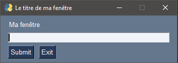
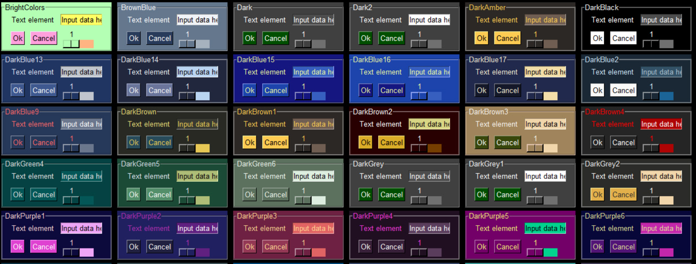

# __Avancement et Notes__
*Avancement et notes sur la partie "formulaire" avec PySimpleGUI*


## __Le module PySimpleGUI__

Nous allons ici faire un résumé des fonctionnalités du module `PySimpleGUI` et de ce qu'il offre dans la création de fenêtes et d'applications GUI, plutôt dans la branche formulaires de bureautique.
Le module étant basé sur `Tkinter`, il y a de nombreux éléments compatibles entre ces deux modules et beaucoup de similitudes.

### __I. Créer une fenêtre basique__

Créer une fenêtre basique dans `PySimpleGUI`, c'est très simple et ça se fait en une seule ligne : 

```python
import PySimpleGUI as sg 

window = sg.Window("Titre de la fenêtre", layout)
```

Notre fenêtre est créée, et ce à partir d'un `layout` (qui n'est pas défini dans le code ci-dessus). Un layout, c'est une liste d'éléments imbriqués qui permet d'obtenir une fenêtre.
En fait, l'agencement de la fenêtre est fait selon l'imbrication des listes d'objets que l'on met dans notre liste : une liste comportant 2 listes fera une application qui possède deux widgets superposés par exemple. Avec un exemple rapide, voilà à quoi ressemble un layout et ce que cela donne :

```python
import PySimpleGUI as sg 

layout = [
    [sg.Text('Ma fenêtre')],
    [sg.Input()],
    [sg.Submit(), sg.Exit()]
]

window = sg.Window('Le titre de ma fenêtre', layout=layout)
window.read() // Afficher et lire les evènements de la fenêtre 
```

Ce qui affiche : 



Cette technique des listes imbriquées pour représenter notre fenêtre est très pratique et très visuelle pour créer rapidement des fenêtres, mais elle a tendance à vraiment encombrer le code lorsqu'on a une grande fenêtre avec beaucoup d'éléments dedans.

<br/>

### __II. Les widgets__

PySimpleGUI possède énormement de widgets très pratiques et basiques, dont certains que l'on peut retrouver sur `Tkinter` comme le `Canvas`. On peut même ajouter des éléments `Tkinter` dans notre fenêtre `PySimpleGUI` !

Voici une petite list des widgets les plus communs : 

  - `Input()` un champ où l'on peut rentrer du texte
  - `Button()` pour faire un bouton
  - `Checkbox()` pour faire des cases à cocher
  - `Radio()` pour faire des boutons radio
  - `Slider()` pour faire des curseurs à faire glisser
  - `Image()` pour afficher des images 

La liste de tous ces widgets est longue, et en plus de cela il a des types de widgets que l'on pourrait qualifier de "presets", c'est-à-dire des boutons déjà préparés et configurés pour aller plus vite. On peut noter :

- `FileBrowse()` un bouton avec écrit "Browse" qui ouvre une sélection de fichier dans l'explorateur de l'OS une fois cliqué
- `Submit(), Exit(), Cancel()` des boutons qui permettent de soumettre, de quitter ou d'annuler des opérations

Chaque objet possède un attribut que l'on définit à la création (on peut aussi ne pas en définir si il n'y a pas besoin), qui est une clé permettant d'identifier l'élément. Par exemple, on peut créer un widget de texte `Text("Ceci est un texte", key='-TEXT-')` (la convention étant une chaîne de caractères en majuscule entourée de tirets, mais cela peut aussi être un nombre, un caractère, etc). Pour faire référence à cet élément de la fenêtre, on pourra appeler `window['-TEXT-']` comme si notre fenêtre était un dictionnaire Python.
Ce fonctionnement est très pratique pour la gestion des évènements.

<br/>

### __III. La gestion des évènements__

La gestion des évènements se fait à l'intérieur d'une boucle, où l'on lit les évènements de la fenêtre.

```python
import PySimpleGUI as sg 

layout = [
    [sg.Text('Ma fenêtre')],
    [sg.Input()],
    [sg.Exit(key='-EXIT-')]
]

window = sg.Window('Le titre de ma fenêtre', layout=layout)

if __name__=='__main__':
    while True:
        event, values = window.read()
        
        if event=='-EXIT-':
            break 
    
    window.close()
```

Dans ce code, la variable `event` représente la clé sur laquelle l'évènement s'est produit, et `values` les valeurs de l'évènement (par exemple, si on a un champ où l'utilisateur peut rentrer du texte, l'évènement pourrait être '-INPUT-' par exemple et la valeur le texte contenu dans le champ).

Grâce à la méthode `update()`, tous les éléments peuvent être mis à jour en fonction de ce que fait l'utilisateur, avec des spécificités pour chaque widget (on ne peut pas modifier la police d'un bouton radio par exemple).

<br/>

### __IV. Autres fonctionnalités notables__

**L'alignement des widgets**

On l'a vu, pour placer ses widgets on utilise des listes imbriquées, et pour les aligner, chaque widget possède des attributs `justification` (ou `element-justification` si le widget contient d'autres widgets), ce qui rend assez facile de centrer ses widgets et de définir leurs marges.

**Les thèmes**

Le module propose différents thèmes de couleurs pour rendre notre application plus belle et cohérente, ce qui est un bon point pour les personnes qui n'ont pas la fibre artistique et qui n'ont pas envie de modifier toutes les images de tous les boutons du module.
Pour définir un thème, une simple ligne suffit au début du programme : 

```python
sg.Theme("Dark Green 5")
```

Voici des visuels de thèmes que l'on peut retrouver (ce n'est qu'une petite partie) : 



*Remarque : il est possible de modifier les thèmes et même de créer son propre thème*

**L'intégration de Matplotlib**

Comme `PySimpleGUI` est lié à `Tkinter`, il est aussi possible d'intégrer des graphs Matplotlib dans le GUI, à travers des `FigureCanvasTkAgg`.

**Plusieurs fenêtres**

Il est tout à faire possible de réaliser un programme avec plusieurs fenêtres simultanées, et il y a une fonction intégrée qui détecte les évènements et sur quelle fenêtre ces derniers interviennent. Il est également possible de désactiver certaines fenêtre pendant l'utilisation d'autres.
<br/>

### __VI. Les autres versions de PySimpleGUI__

Le module existe avec différents backends, comme `Tkinter`, `Wx` ou `Qt`, mais ces derniers sont très limités : 
    - Ils possèdent moins de widgets 
    - Ils sont parfois buggés (comme la version web)

De manière générale, comme `PySimpeGUI` a été créé pour utiliser `Tkinter`, il vaut mieux le privilégier pour un projet.

*Remarque : changer de backend en cours de route est quasi-impossible, surtout si on commence avec Tkinter*

### __VII. Avantages et inconvénients__

**Les points positifs** :

* **Documentation très fournie** : bien que le module soit tenu par une seule personne, la documentation sur le sujet est très fournie notamment sur le site `https://pysimplegui.readthedocs.io/``qui regroupe des tutoriels, des notions, la liste des appels et des classes, le tout très bien expliqué. En plus d'une partie sur la liste de toutes les fonctions, il y a un "cookbook" qui permet de prendre en main le tout avec du code extrêmement bien expliqué et une vingtaines d'exemples de programmes qui sont utile.
* **Erreurs explicites** : le module fournit des erreurs assez explicites et propose des corrections ou des choses à vérifier à chaque erreurs, ce qui permet de débugger très rapidement les applications.
* **Relativement customisable** : le module possède beaucoup d'options de customisation, il est possible de quasiment tout faire et modifier 

**Les points négatifs** :

* **Code parfois "fouilli"** : quand on fait des grandes applications avec énormement de widgets, le principe des listes imbriquées géantes peut perdre de ses avantages, et il est dur de se retrouver dans le code
* **Parfois peu intuitif** : ce point est discutable, mais parfois il n'est pas intuitif que chaque widget ne soit pas affecté à une variable en Python, et que l'on fasse référence à ces derniers par des clés (cela peut perdre les débutants) et lorsque on lit `if event=='-WIDGET-'` on peut interpréter "si l'évènement est un widget" à la place de "si l'évènement se produit sur le widget". Au final, ce sont pleins de petits détails dans la syntaxe du module qui peuvent parfois être un peu confus pour des débutants en Python.  
* **Les backend autres que Tkinter sont mauvais** : il est impossible de chagner de backend (Tkinter, WxPython, Qt) en cours de route car certaines fonctions ont d'autres noms ou ne sont tout simplement pas présentes selon les versions, parfois ce ne sont que simples mots-clés dans les arguments de fonctions mais c'est très pénible. La librairie est très orientée pour utiliser `Tkinter`.